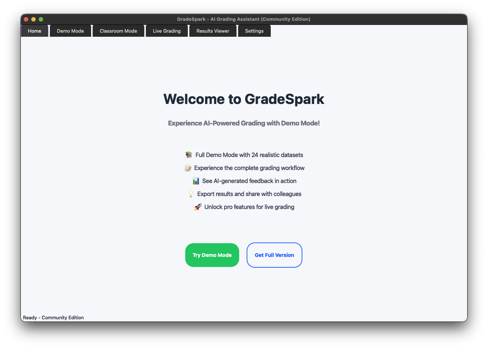
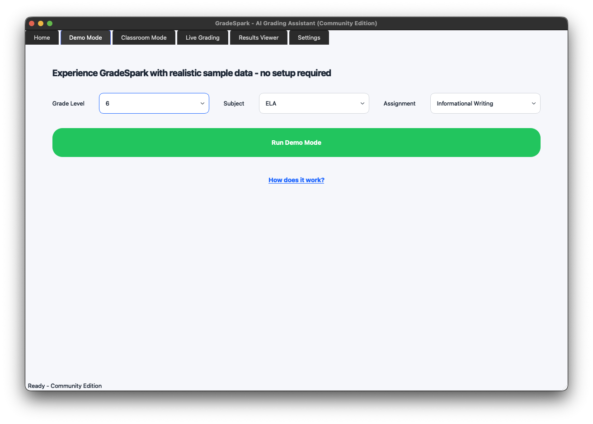
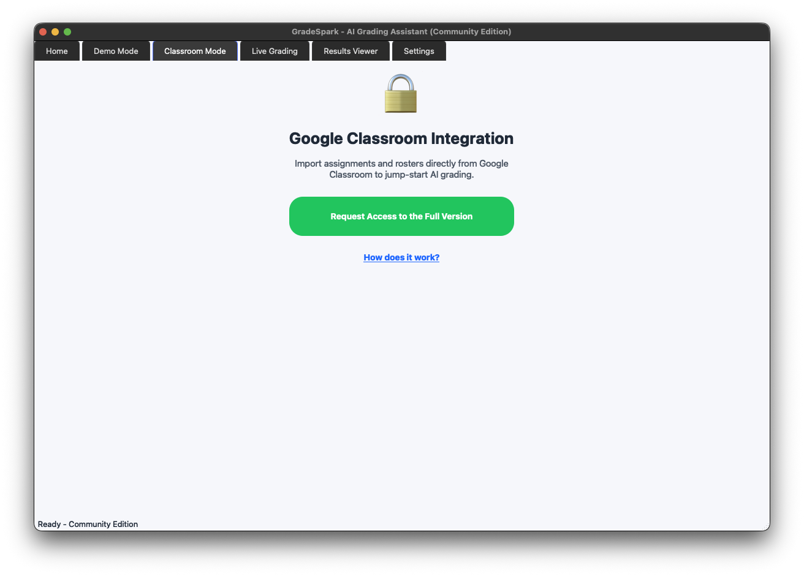
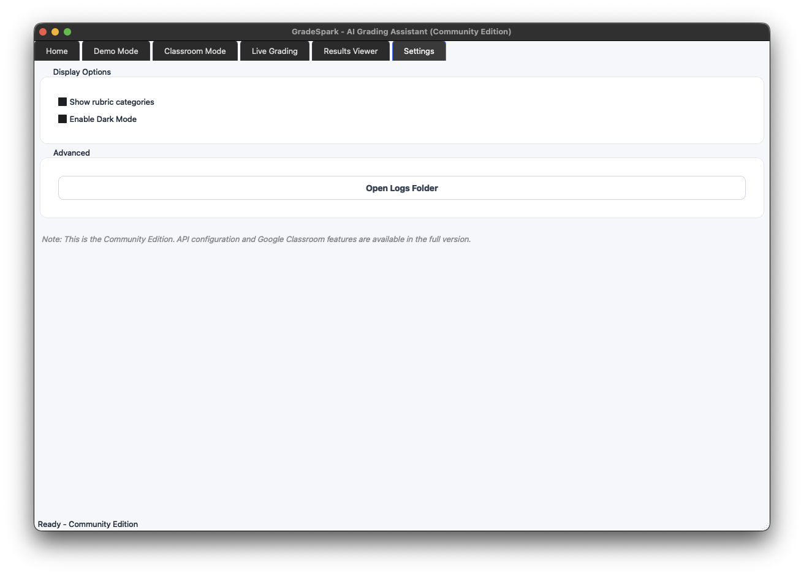
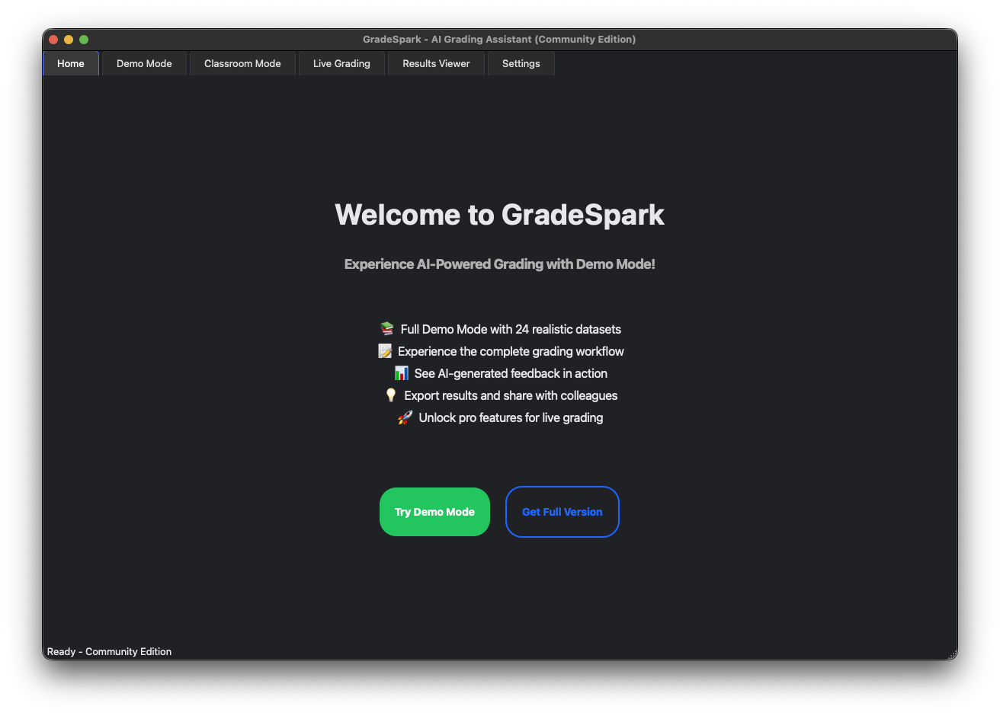
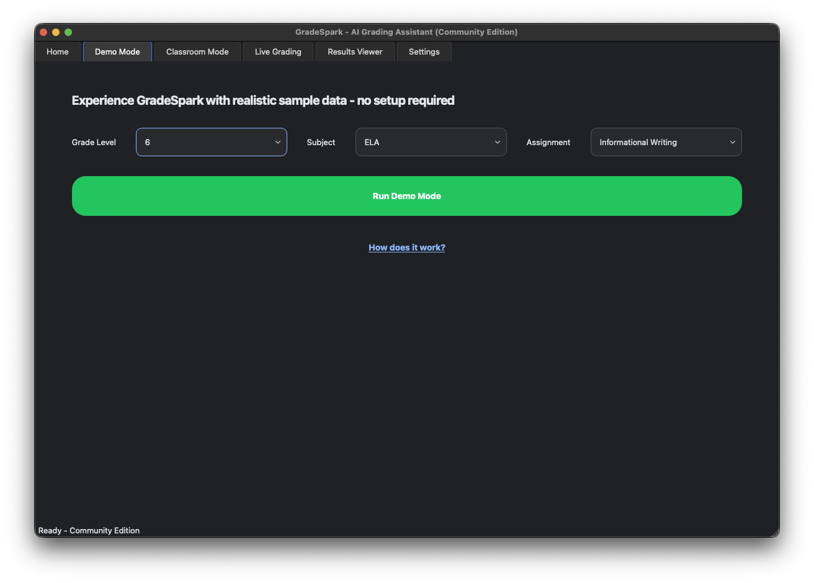
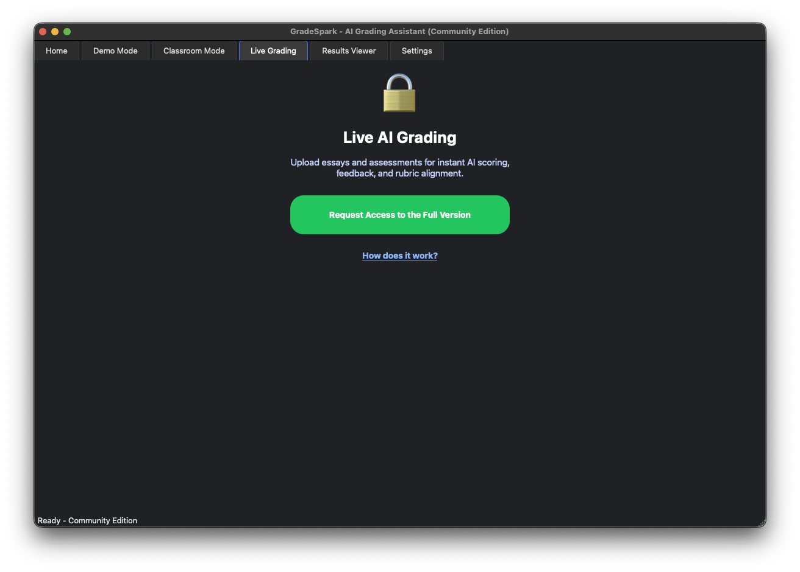
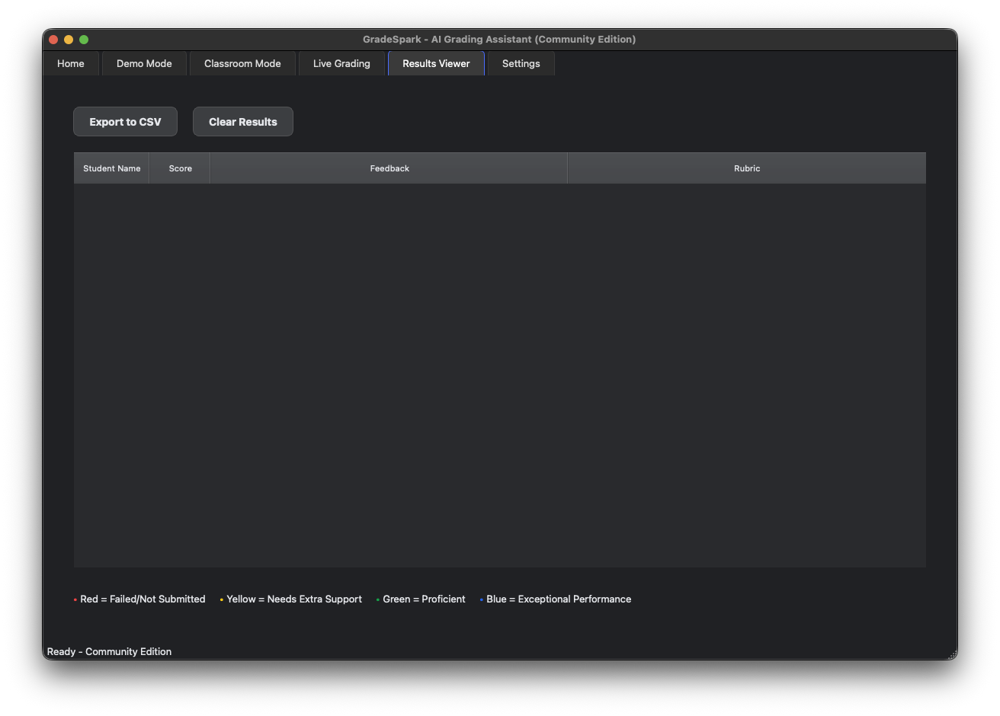

# 🚀 GradeSpark Community Edition

**Experience the future of grading.** Try GradeSpark's Demo Mode with realistic sample data - no setup required.


## 📢 What is GradeSpark Community Edition?

This is the **free, offline, open-source version** of GradeSpark - an AI-powered grading assistant that gives teachers their time back. While the full version includes Google Classroom integration and live AI grading, this Community Edition lets you experience the complete workflow with Demo Mode.

### Community Edition vs Full Version

| Feature | Community Edition | Full Version |
|---------|------------------|--------------|
| Demo Mode (24 sample datasets) | ✅ Full Access | ✅ Full Access |
| UI/UX (all 6 tabs) | ✅ Full Interface | ✅ Full Interface |
| Dark/Light themes | ✅ Included | ✅ Included |
| Results export (CSV) | ✅ Working | ✅ Working |
| Google Classroom | 🔒 Lead Capture Form | ✅ Full Integration |
| Live AI Grading | 🔒 Lead Capture Form | ✅ OpenAI Powered |
| Document Processing | ❌ Not Available | ✅ PDF/DOCX/Images |
| Custom Rubrics | ❌ Not Available | ✅ Fully Customizable |

## 🎯 Perfect For

- **Teachers** curious about how AI grading can help them save time
- **Administrators** evaluating grading solutions for their schools and monitoring proficiency
- **Developers** interested in educational technology
- **Researchers** studying AI applications in education

## 🚀 Quick Start

### Option 1: Run from Source (Available Now)
```bash
# Clone the repository
git clone https://github.com/lewisrojas20/gradespark-public.git
cd gradespark-public

# Install dependencies
pip install -r requirements.txt

# Run the application
python3 gradespark_gui.py
Option 2: Download Packaged App (Coming Soon)
```
🍎 macOS App - Currently packaging, will be available as .app in next commit
🪟 Windows Installer - In development, coming after Mac release
### Note: Until packaged versions are ready, please use Option 1 to run from terminal

## ✨ What You Can Do

### With Demo Mode (Fully Functional)

- Experience grading workflow with 24 realistic datasets
- Test all UI features and navigation
- See how AI feedback looks (simulated)
- Export results to CSV
- Switch between light/dark themes
- Understand the time-saving potential

### Sample Data Included

- Grades: 6, 7, 8
- Subjects: History, ELA, Math, Science
- Assignments: 2 per subject per grade
- Students: 15 per class (with realistic non-submissions)

🔒 Premium Features (Lead Capture)
When you click on Classroom Mode or Live Grading, you'll see a lead capture form. Submit your info to be among the first teachers to get early access to:

- Google Classroom Integration: Pull assignments directly from Google Classroom and select which classes and assignments you want to grade
- Live AI Grading: Grade any type of student work whether a quiz or an essay in any format (PDF, DOCX, PPT, Images, etc)
- Custom Rubrics: Tailor feedback to your standards with a personalized tone and/or custom-made rubric to match any curriculum.

## 🖼️ Screenshots

### Light Mode
<table>
  <tr>
    <td align="center">
      <br />
      <sub><b>Welcome Screen</b></sub>
    </td>
    <td align="center">
      <br />
      <sub><b>Demo Mode</b></sub>
    </td>
  </tr>
  <tr>
    <td align="center">
      <br />
      <sub><b>Live Grading</b></sub>
    </td>
    <td align="center">
      <br />
      <sub><b>Classroom Integration</b></sub>
    </td>
  </tr>
  <tr>
    <td align="center">
      <br />
      <sub><b>Grading Results</b></sub>
    </td>
    <td align="center">
      <br />
      <sub><b>Settings Panel</b></sub>
    </td>
  </tr>
</table>

### Dark Mode
<table>
  <tr>
    <td align="center">
      <br />
      <sub><b>Welcome Screen (Dark)</b></sub>
    </td>
    <td align="center">
      <br />
      <sub><b>Demo Mode (Dark)</b></sub>
    </td>
  </tr>
  <tr>
    <td align="center">
      <br />
      <sub><b>Live Grading (Dark)</b></sub>
    </td>
    <td align="center">
      <br />
      <sub><b>Classroom Integration (Dark)</b></sub>
    </td>
  </tr>
  <tr>
    <td align="center">
      <br />
      <sub><b>Grading Results (Dark)</b></sub>
    </td>
    <td align="center">
      <br />
      <sub><b>Settings Panel (Dark)</b></sub>
    </td>
  </tr>
</table>

## 🛠️ Technical Details
```bash
Requirements

Python 3.9+
PyQt5
pandas
100MB disk space
```

## Project Structure
```bash
gradespark-public/
├── gradespark_gui.py          # Main application
├── demo_data_manager.py       # Demo data handler
├── settings_store.py          # Settings persistence
├── styles.qss                 # Light theme
├── styles_dark.qss           # Dark theme
├── demo_data/                # Sample CSV files
│   ├── 6/                    # Grade 6 samples
│   ├── 7/                    # Grade 7 samples
│   └── 8/                    # Grade 8 samples
├── assets/                   # Icons and images
└── docs/                     # Screenshots
```

## 🗺️ Roadmap
### Immediate (This Week)

 - Community Edition release
 - macOS .app package
 - Windows .exe installer
 - Installation video tutorial

### Next Steps

 - Linux AppImage
 - Docker container option
 - More demo datasets
 - Localization support

## 🤝 Contributing
We welcome contributions! Feel free to:

- Report bugs
- Suggest features
- Improve documentation
- Add more demo datasets
- Help with packaging

## 💬 Get the Full Version
Interested in the full version with AI grading and Google Classroom?
- For Teachers: Email lewisrojas20@gmail.com for early access
- For Schools: Email lewisrojas20@gmail.com and request a demo for your district

## 📄 License
This Community Edition is released under MIT License. Use it, modify it, share it!
The full version of GradeSpark is proprietary software with subscription pricing.

## 🙏 Acknowledgments
Built with:

- PyQt5 - Cross-platform GUI framework
- pandas - Data manipulation

Note: This is the Community Edition designed to let you experience GradeSpark's interface and workflow. For actual AI grading and classroom integration, please consider the full version.

Made with ❤️ for educators!
