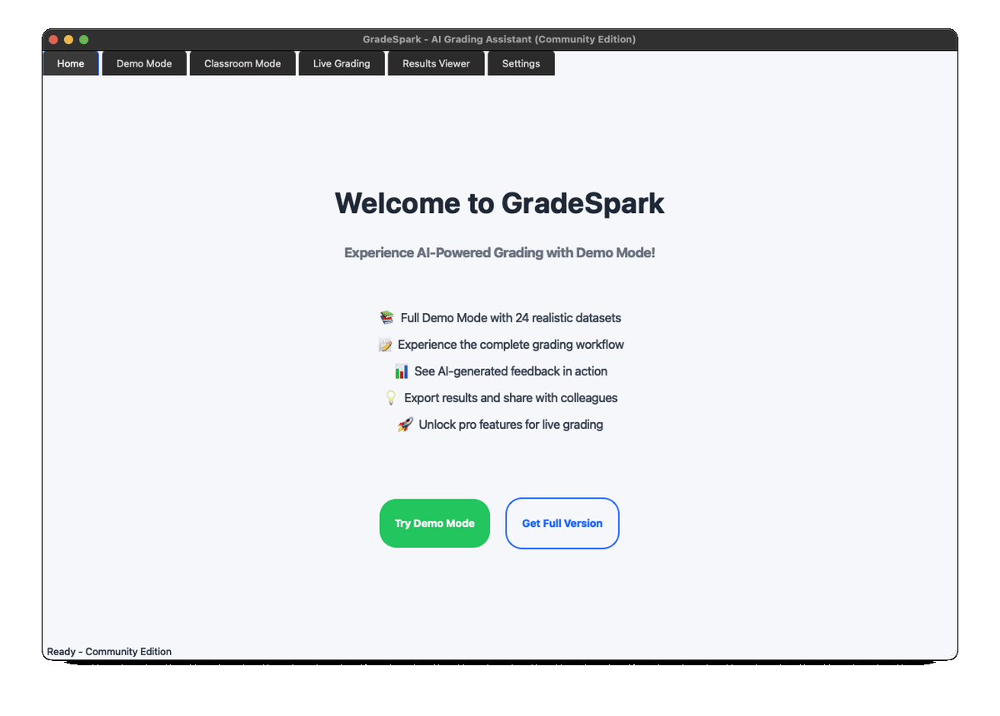
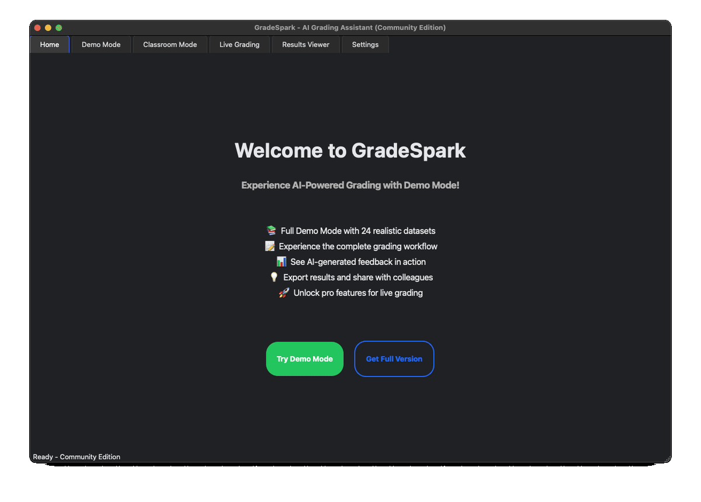

# 🚀 GradeSpark Community Edition

**Experience the future of grading.** Try GradeSpark's Demo Mode with realistic sample data - no setup required.


[](https://github.com/lewisrojas20/gradespark-public/releases/latest)
[](#-license)

## 📢 What is GradeSpark Community Edition?

This is the **free, offline, open-source version** of GradeSpark - an AI-powered grading assistant that gives teachers their time back. While the full version includes Google Classroom integration and live AI grading, this Community Edition lets you experience the complete workflow with Demo Mode.

### Community Edition vs Full Version

| Feature | Community Edition | Full Version |
|---------|------------------|--------------|
| Demo Mode (24 sample datasets) | ✅ Full Access | ✅ Full Access |
| UI/UX (all 6 tabs) | ✅ Full Interface | ✅ Full Interface |
| Dark/Light themes | ✅ Included | ✅ Included |
| Results export (CSV) | ✅ Working | ✅ Working |
| Privacy | ✅ 100% Offline | ⚠️ Cloud features (opt-in) |
| Google Classroom | 🔒 Lead Capture Form | ✅ Full Integration |
| Live AI Grading | 🔒 Lead Capture Form | ✅ AI Powered |
| Document Processing | ❌ Not Available | ✅ PDF/PPT/DOCX/Images |
| Custom Rubrics | ❌ Not Available | ✅ Fully Customizable |
| Custom Feedback Tone | ❌ Not Available | ✅ Fully Customizable |


## 🎯 Perfect For

- **Teachers** curious about how AI grading can help them save time and revolutionize their way of grading
- **Administrators** evaluating grading solutions for their schools and monitoring datasets to analyze results per grade/per subject
- **Developers** interested in educational technology
- **Researchers** studying AI applications in education

## Option 1: Download ⬇️ 

**macOS (Ready)** 🍎
1. [Download GradeSpark Community Edition for macOS](https://github.com/lewisrojas20/gradespark-public/releases/download/v1.0.0/Gradespark-Community-Edition-v1.0.0-macOS-arm64.zip)
2. Unzip and drag **GradeSpark.app** to **Applications**.
3. First launch on macOS:
   - If you see a security prompt (unverified developer), **Right-click → Open** and confirm. 

Note: We’ll add code signing/notarization in a future build for a smoother first run.

**Windows (Almost Ready)** 🪟
- Installer will be added to Releases after polishing & packaging is complete.

## Verify Download (SHA-256)
`06c92cd4eb7180a8098b7ab96bce9ba0dbe929197076c6222dfd6e025ff471e2`

## Option 2: Run from Source (macOS/Windows)
```bash
# Clone the repository
git clone https://github.com/lewisrojas20/gradespark-public.git
cd gradespark-public

# Activate virtual environment
# macOS: 
python3 -m venv .venv && source .venv/bin/activate   

# Windows: 
.venv\Scripts\activate

# Install dependencies (macOS - pip3 | Windows: pip)
pip3 install -r requirements.txt

# Run the application
python3 gradespark_gui.py
```

## ✨ What You Can Do

### With Demo Mode (Fully Functional)

- Experience grading workflow with 24 realistic datasets
- Test all UI features and navigation
- See how AI feedback looks (simulated)
- Export results to CSV
- Switch between light/dark themes
- Experience the time-saving potential

### Sample Data Included

- Grades: 6, 7, 8
- Subjects: History, ELA, Math, Science
- Assignments: 2 per subject per grade
- Students: 15 per class (with realistic non-submissions)

🔒 Premium Features (Lead Capture)
When you click on Classroom Mode or Live Grading, you'll see a lead capture form. Submit your info to be among the first teachers to get early access to:

- Google Classroom Integration: Pull assignments directly from Google Classroom and select which classes and assignments you want to grade
- Live AI Grading: Grade ANY type of student work, anything from a quiz to an essay in any format (PDF, DOCX, PPT, Images, etc.)
- Custom Rubrics:  Create custom-made rubrics to match any curriculum you are teaching
- Custom Feedback Tone: Tailor feedback to your standards with a personalized tone that matches your style!

## 🖼️ Screenshots (GIF)





## 🛠️ Technical Details

**Requirements**
- macOS 12+ (Monterey) or Windows 10+
- Python 3.9+ (only needed if running from source)
- PyQt5, pandas (installed via `requirements.txt`)
- ~100MB disk space


## Project Structure
```bash
gradespark-public/
├── gradespark_gui.py          # Main application
├── demo_data_manager.py       # Demo data handler
├── settings_store.py          # Settings persistence
├── styles.qss                 # Light theme
├── styles_dark.qss           # Dark theme
├── demo_data/                # Sample CSV files
│   ├── 6/                    # Grade 6 samples
│   ├── 7/                    # Grade 7 samples
│   └── 8/                    # Grade 8 samples
├── assets/                   # Icons and images
└── docs/                     # Screenshots
```

## 🗺️ Roadmap

### ✅ Now
 - Community Edition release (v1.0.0) 
 - macOS app package (.zip) 


### 🚧 In Progress
 - Windows .exe installer
 - Installation video tutorial
 - More demo datasets
 - Localization support

## 🤝 Contributing
We welcome contributions! Feel free to:

- Report bugs
- Suggest features
- Improve documentation
- Add more demo datasets
- Help with packaging

> Dev quickstart: clone, create a virtual env, `pip install -r requirements.txt`, run `python3 gradespark_gui.py`.

## 🔒 Privacy
GradeSpark Community Edition can run without internet. All data stays on your device. Internet is required to submit information for early access. We use any form submissions to invite early users and keep you updated as features roll out. No telemetry.

## 📬 Support / Contact
Questions or feedback? Open a [GitHub Issue](../../issues) or email **lewisrojas20@gmail.com**.

## 📄 License
This Community Edition is released under MIT License. Use it, modify it, share it!
The full version of GradeSpark is proprietary software with subscription pricing.

## 🙏 Acknowledgments
Built with:

- PyQt5 - Cross-platform GUI framework
- pandas - Data manipulation

Note: This is the Community Edition designed to let you experience GradeSpark's interface and workflow. For actual AI grading and classroom integration, please consider the full version.

**Made with ❤️ for educators!
